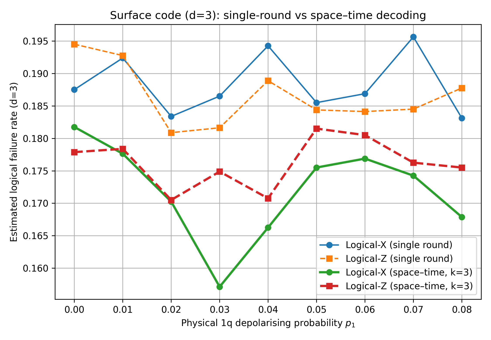

# Quantum Error Correction Experiments

This repository contains two Jupyter notebooks exploring quantum error correction (QEC) using Qiskit:

- **`repetition-code.ipynb`** — A simple 3-qubit repetition code, illustrating the basics of encoding, noise, and majority-vote decoding.
- **`3-distance-surface-code.ipynb`** — A  distance-3 planar surface code with both single-round and space–time decoding, including a comparison of logical failure rates.

## Features

- QEC simulation with depolarising + readout noise models
- Surface code stabilizer layout and syndrome extraction
- MWPM (minimum-weight perfect matching) decoders for both 2D and 3D (space–time)
- Performance plots comparing decoding strategies

## Example Results

We include **10 example plots** comparing single-round decoding vs. k-round space–time decoding in the  
[`image-results/`](image-results) folder.

Across these examples:

- Space–time decoding (`k` rounds) consistently outperforms single-round decoding.
- Typical estimated logical failure rates:
  - `k`-round space–time: ~**0.16–0.18**
  - Single-round: ~**0.18–0.20**

Example:



---

## Requirements

- Python 3.9+
- [Qiskit](https://qiskit.org/)
- NetworkX
- Matplotlib
- NumPy

Install with:
```bash
pip install qiskit networkx matplotlib numpy
