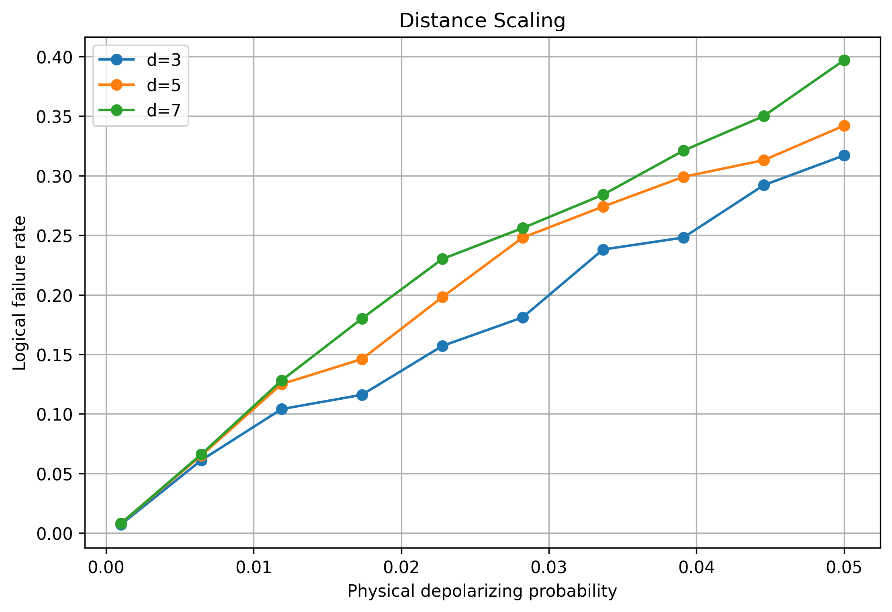
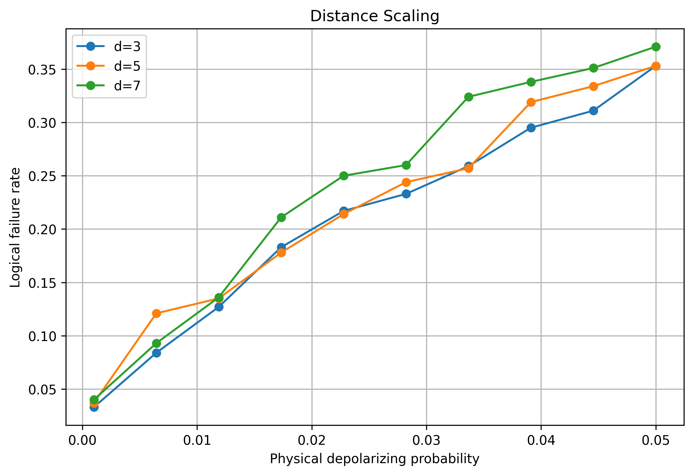

# Quantum Error Correction Surface Code Simulator

A modular quantum error correction (QEC) simulator for studying planar surface codes using Stim and PyMatching. The project provides tools for constructing surface-code circuits, generating detector error models (DEMs), performing Minimum Weight Perfect Matching (MWPM) decoding, and evaluating logical failure rates through Monte Carlo simulation.

The simulator is designed as a modular research platform that can be extended with alternative decoders, noise models, and future threshold studies.

---

## Features

- Configurable odd code distances (`d = 3, 5, 7, ...`)
- Multi-round syndrome extraction
- Stim-based circuit generation
- Detector Error Model (DEM) generation
- PyMatching MWPM decoder
- Depolarising and readout noise models
- X- and Z-memory experiments
- Logical failure-rate simulations
- Distance-scaling experiments
- Modular architecture with comprehensive unit tests

---

## Repository Structure

```text
src/qec/
├── geometry.py
├── stim_backend.py
├── simulation.py
├── visualization.py
├── decoders/
│   ├── base.py
│   ├── mwpm.py
│   └── networkx.py
└── legacy/
    ├── circuit.py
    ├── noise.py
    ├── simulation.py
    └── syndrome.py

experiments/
├── compare_decoders.py
└── logical_failure_stim.py

results/
├── comparison/
└── logical_failure/
    ├── X/
    └── Z/

tests/
├── test_geometry.py
├── test_stim_backend.py
├── test_simulation.py
├── decoders/
│   ├── test_mwpm.py
│   └── test_networkx.py
└── legacy/
    ├── test_circuit.py
    ├── test_simulation.py
    └── test_syndrome.py

notebooks/
└── demo.ipynb
```

### Legacy Implementation

The `legacy/` package contains the original **Qiskit**-based implementation of the simulator, including circuit construction, syndrome extraction, noise modelling, simulation, and the reference NetworkX decoder. It is retained for comparison, regression testing, and historical reference.

Active development is focused on the **Stim**-based simulation pipeline, which provides detector error model (DEM) generation, PyMatching decoding, and serves as the foundation for future planar surface-code geometry and threshold studies.

---

## Example Experiment

Run the logical memory experiment:

```bash
python experiments/logical_failure_stim.py
```

This performs Monte Carlo simulations for both **X** and **Z** memory bases across multiple code distances and produces logical failure-rate and distance-scaling plots.

---

## Example Result

### Logical Failure Rate (X Memory)



### Logical Failure Rate (Z Memory)



---

## Current Status

The complete **Stim → Detector Error Model (DEM) → PyMatching** decoding pipeline is operational. The current implementation uses a simplified checkerboard stabilizer layout rather than the full planar surface-code geometry. Consequently, the simulator does not yet reproduce the expected reduction in logical error rate with increasing code distance. 

The next development milestone is implementing physically accurate planar surface-code geometry with rough and smooth boundaries, boundary stabilizers, and geometry-derived logical operators.

---

## Future Work

- Physically accurate planar surface-code geometry
- Boundary stabilizers
- Geometry-derived logical operators
- Threshold analysis
- Alternative decoder benchmarking
- GitHub Actions CI

---

## Testing

Run the complete test suite:

```bash
pytest
```

---

## Requirements

- Python 3.10+
- Stim
- PyMatching
- NumPy
- NetworkX
- Matplotlib
- Pytest
- Qiskit (legacy simulation pipeline)

Install dependencies:

```bash
pip install qiskit stim pymatching numpy networkx matplotlib pytest
```
