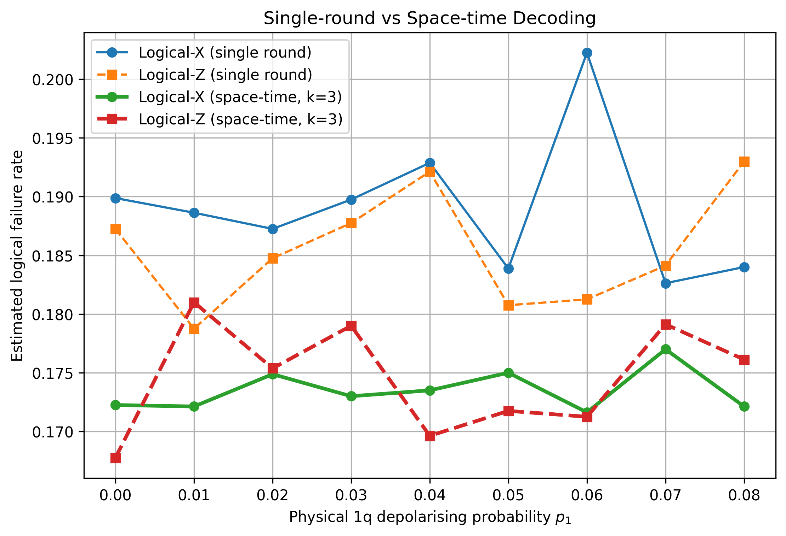

# Quantum Error Correction Simulator

A Python-based quantum error correction (QEC) simulator built with Qiskit, focused on syndrome extraction, noise modelling, and Minimum Weight Perfect Matching (MWPM) decoding for topological quantum error-correcting codes.

The current implementation includes a distance-3 planar surface code with syndrome extraction, noise modelling, and MWPM-based decoding. The project is being extended towards larger code distances, threshold studies, and alternative decoder backends.

---

## Features

- Distance-3 planar surface code
- Multi-round syndrome extraction
- MWPM decoding
- Space-time decoding
- Depolarising and readout noise models
- Monte Carlo simulation framework
- Unit tests and reproducible experiments

---

## Repository Structure

```text
src/qec/
├── geometry.py
├── circuit.py
├── syndrome.py
├── decoder.py
├── noise.py
├── simulation.py
└── visualization.py

experiments/
└── compare_decoders.py

results/
└── comparison/
    └── decoder_comparison.png

tests/
├── test_geometry.py
├── test_syndrome.py
├── test_decoder.py
└── test_circuit.py

notebooks/
├── demo.ipynb
└── repetition-code-simulation.ipynb
```

---

## Example Experiment

Compare single-round and space-time decoding:

```bash
python experiments/compare_decoders.py
```

This runs a sweep over physical error rates and generates:

```text
results/comparison/decoder_comparison.png
```

---

## Example Result



---

## Testing

Run the unit test suite:

```bash
pytest
```

---

## Future Work

- Configurable code distances (d = 3, 5, 7, ...)
- Threshold analysis
- Stim integration
- PyMatching backend
- Decoder benchmarking
- GitHub Actions CI

---

## Requirements

- Python 3.10+
- Qiskit
- NumPy
- NetworkX
- Matplotlib
- Pytest

Install dependencies:

```bash
pip install qiskit numpy networkx matplotlib pytest
```
