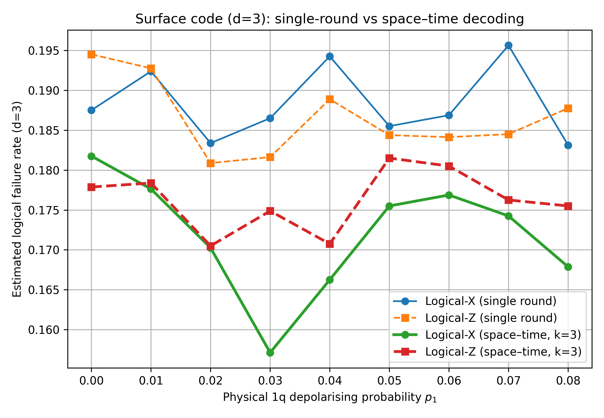

# Quantum Error Correction Experiments

This repository contains quantum error correction (QEC) simulations implemented in Python using Qiskit, focusing on fault-tolerant quantum computing and decoding of topological error-correcting codes.

Current implementations include a 3-qubit repetition code and a distance-3 planar surface code with MWPM decoding and space–time error correction. The project is being actively extended towards a more general quantum error correction research platform, with planned support for larger code distances, threshold analysis, and benchmarking studies.

Current implementations:

- **`repetition-code.ipynb`** — A simple 3-qubit repetition code, illustrating the basics of encoding, noise, and majority-vote decoding.
- **`3-distance-surface-code.ipynb`** — A  distance-3 planar surface code with both single-round and space–time decoding, including a comparison of logical failure rates.

## Features

- QEC simulation with depolarising + readout noise models
- Surface code stabilizer layout and syndrome extraction
- MWPM (minimum-weight perfect matching) decoders for both 2D and 3D (space–time)
- Performance plots comparing decoding strategies

## Example Results

We include **10 example plots** comparing single-round decoding vs. k-round space–time decoding in the  
[`image-results/`](image-results) folder.

Across these examples:

- Space–time decoding (`k` rounds) consistently outperforms single-round decoding.
- Typical estimated logical failure rates:
  - `k`-round space–time: ~**0.16–0.18**
  - Single-round: ~**0.18–0.20**

Example:



---

## Roadmap

### Completed

- 3-qubit repetition code simulation
- Distance-3 planar surface code implementation
- Depolarising and readout noise models
- 2D MWPM decoder
- 3D MWPM (space-time) decoder
- Multi-round syndrome extraction
- Logical failure rate analysis and decoder comparison

### In Progress

- Refactoring notebook implementations into reusable Python modules
- Improving repository structure and testing

### Planned

- Configurable code distances (d = 3, 5, 7, ...)
- Threshold analysis across physical error rates
- Additional noise models
- Decoder benchmarking and performance analysis
- CI/CD with GitHub Actions

## Requirements

- Python 3.9+
- [Qiskit](https://qiskit.org/)
- NetworkX
- Matplotlib
- NumPy

Install with:
```bash
pip install qiskit networkx matplotlib numpy

